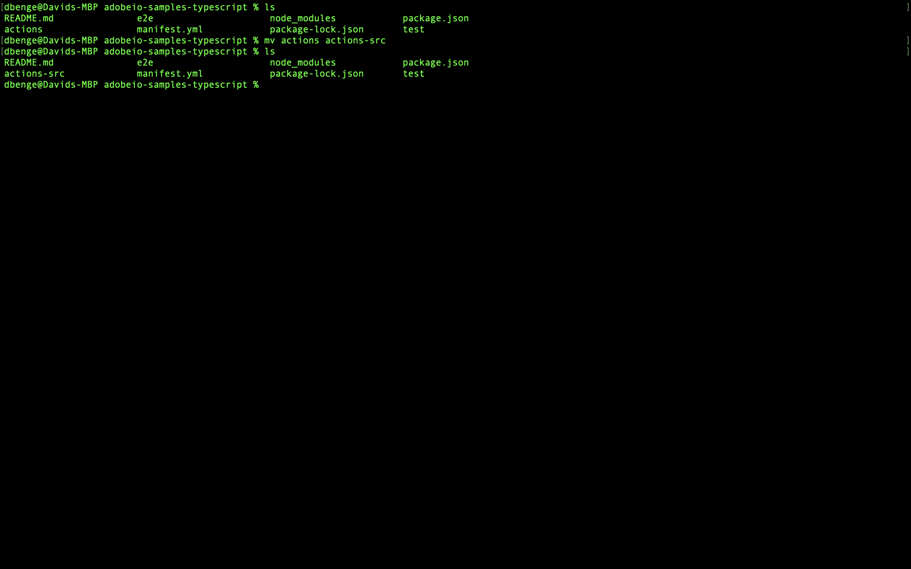
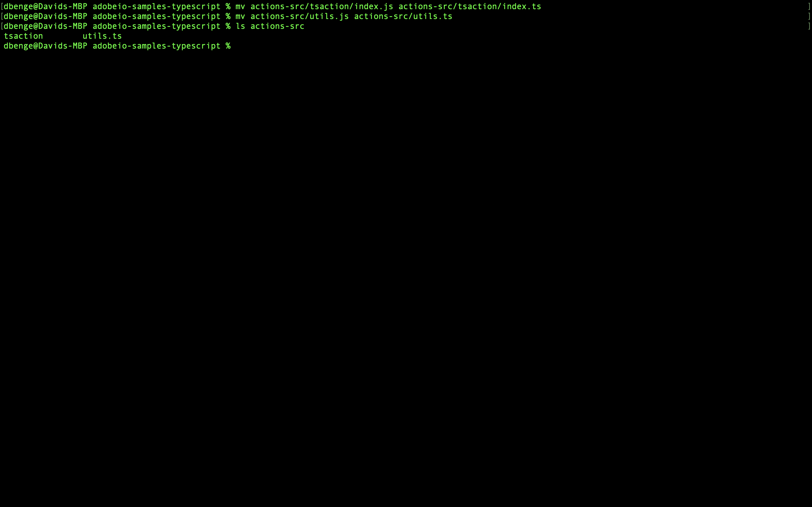

## Lesson 2: Converting application to TypeScript

### Step one: move the code
When we first generated the project the aio CLI created some default directories for us to use and some boilerplate code as well.  We need to move this boilerplate and convert it to TypeScript. 

First step is to rename the `actions` folder and rename it to `actions-src`.  


### Step two: convert the code
We now need to convert the boilerplate code from Javascript to TypeScript.
There should just be two files that we need to convert to TypeScript
`actions/tsaction/index.js` and `actions/utils.js` 

To convert these two files we start with changing the file extension from `.js` to `.ts.` 
`actions/tsaction/index.ts` and `actions/utils.ts`



Now we need to modify the files starting with `utils.ts`
In this file we need to change all the functions to have an export keyword in front of them and we will remove the exports statement at the end of the file.
Here is the final `utils.ts`
```javascript
/* 
* <license header>
*/

/* This file exposes some common utilities for your actions */

/**
 *
 * Returns a log ready string of the action input parameters.
 * The `Authorization` header content will be replaced by '<hidden>'.
 *
 * @param {object} params action input parameters.
 *
 * @returns {string}
 *
 */
export function stringParameters (params) {
  // hide authorization token without overriding params
  let headers = params.__ow_headers || {}
  if (headers.authorization) {
    headers = { ...headers, authorization: '<hidden>' }
  }
  return JSON.stringify({ ...params, __ow_headers: headers })
}

/**
 *
 * Returns the list of missing keys giving an object and its required keys.
 * A parameter is missing if its value is undefined or ''.
 * A value of 0 or null is not considered as missing.
 *
 * @param {object} obj object to check.
 * @param {array} required list of required keys.
 *        Each element can be multi level deep using a '.' separator e.g. 'myRequiredObj.myRequiredKey'
 *
 * @returns {array}
 * @private
 */
export function getMissingKeys (obj, required) {
  return required.filter(r => {
    const splits = r.split('.')
    const last = splits[splits.length - 1]
    const traverse = splits.slice(0, -1).reduce((tObj, split) => { tObj = (tObj[split] || {}); return tObj }, obj)
    return traverse[last] === undefined || traverse[last] === '' // missing default params are empty string
  })
}

/**
 *
 * Returns the list of missing keys giving an object and its required keys.
 * A parameter is missing if its value is undefined or ''.
 * A value of 0 or null is not considered as missing.
 *
 * @param {object} params action input parameters.
 * @param {array} requiredHeaders list of required input headers.
 * @param {array} requiredParams list of required input parameters.
 *        Each element can be multi level deep using a '.' separator e.g. 'myRequiredObj.myRequiredKey'.
 *
 * @returns {string} if the return value is not null, then it holds an error message describing the missing inputs.
 *
 */
export function checkMissingRequestInputs (params, requiredParams = [], requiredHeaders = []) {
  let errorMessage = null

  // input headers are always lowercase
  requiredHeaders = requiredHeaders.map(h => h.toLowerCase())
  // check for missing headers
  const missingHeaders = getMissingKeys(params.__ow_headers || {}, requiredHeaders)
  if (missingHeaders.length > 0) {
    errorMessage = `missing header(s) '${missingHeaders}'`
  }

  // check for missing parameters
  const missingParams = getMissingKeys(params, requiredParams)
  if (missingParams.length > 0) {
    if (errorMessage) {
      errorMessage += ' and '
    } else {
      errorMessage = ''
    }
    errorMessage += `missing parameter(s) '${missingParams}'`
  }

  return errorMessage
}

/**
 *
 * Extracts the bearer token string from the Authorization header in the request parameters.
 *
 * @param {object} params action input parameters.
 *
 * @returns {string|undefined} the token string or undefined if not set in request headers.
 *
 */
export function getBearerToken (params) {
  if (params.__ow_headers &&
      params.__ow_headers.authorization &&
      params.__ow_headers.authorization.startsWith('Bearer ')) {
    return params.__ow_headers.authorization.substring('Bearer '.length)
  }
  return undefined
}
/**
 *
 * Returns an error response object and attempts to log.info the status code and error message
 *
 * @param {number} statusCode the error status code.
 *        e.g. 400
 * @param {string} message the error message.
 *        e.g. 'missing xyz parameter'
 * @param {*} [logger] an optional logger instance object with an `info` method
 *        e.g. `new require('@adobe/aio-sdk').Core.Logger('name')`
 *
 * @returns {object} the error object, ready to be returned from the action main's function.
 *
 */
export function errorResponse (statusCode, message, logger) {
  if (logger && typeof logger.info === 'function') {
    logger.info(`${statusCode}: ${message}`)
  }
  return {
    error: {
      statusCode,
      body: {
        error: message
      }
    }
  }
}

```

Now that the utils has been converted lets move to the default action we had the cli build for us.  
In this file we need to convert all the requires to imports at the top of the file
```javascript
import fetch from 'node-fetch'
import { Core } from '@adobe/aio-sdk'
import { errorResponse, getBearerToken, stringParameters, checkMissingRequestInputs } from '../utils'
```
Now we need to change the main function and add on `export`
```javascript
export async function main (params) {
```

Lastly we need to remove the exports statement from the end of the file.  Remove the line `exports.main = main` from the file.  We no longer need this export since we are exporting the function. 


[Next](build.md)