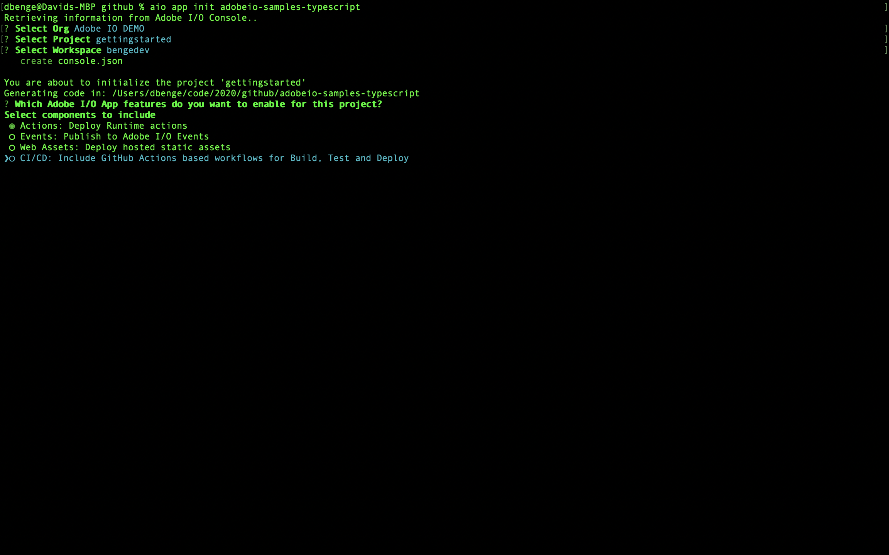
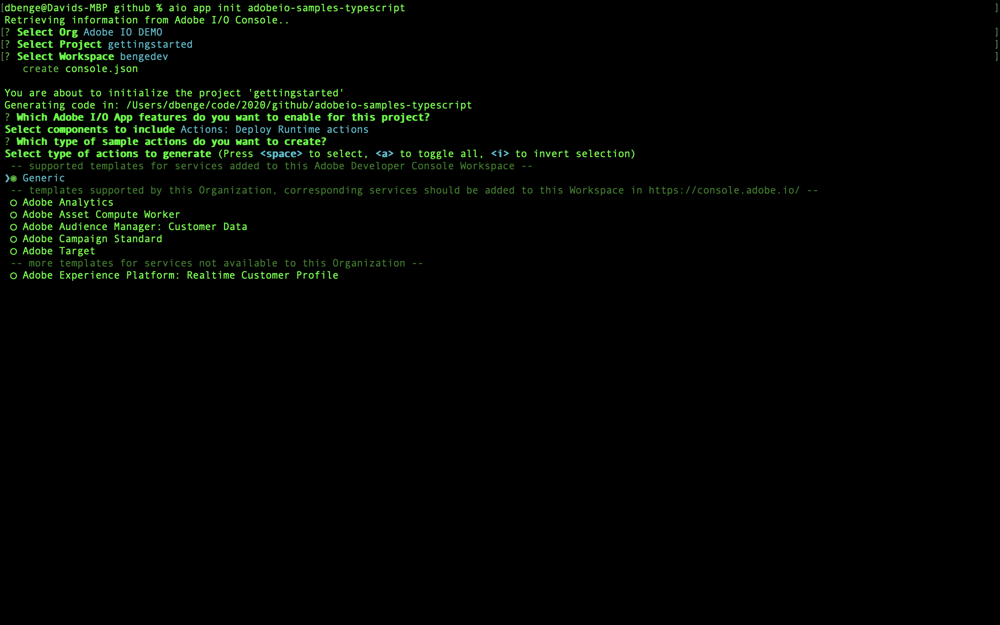
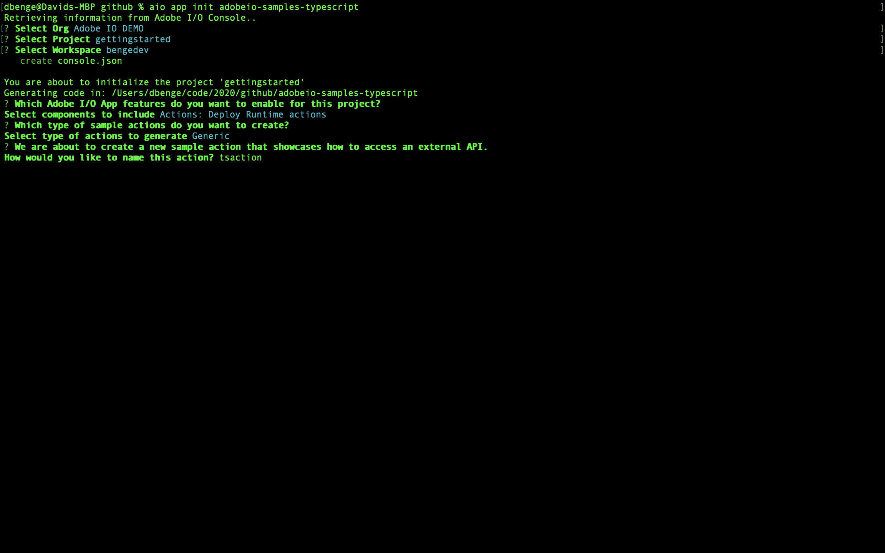

## Lesson 1: Bootstrap a new app

In order to create your barcode application, use the following command:
```bash
aio app init adobeio-samples-typescript  
```
We select the org, project and workspace for our app, and then be presented with a few options what you want your app to include (Serverless Actions, Web UI, CI/CD pipeline, I/O Events). Since we are building a headless app, we're only interested in using `Actions: Deploy Runtime actions`.


The second question, the CLI asks us which experience cloud or experience platform apps you want to extend or build. In this case, we're going to choose `Generic`. 


The third question, we'll specify the action name `tsaction`.


We didn't include the UI setup nor the CI/CD pipeline nor I/O Events. These topics will be covered in other codelabs. 

All done with bootstrap process

[Next](conversion.md)